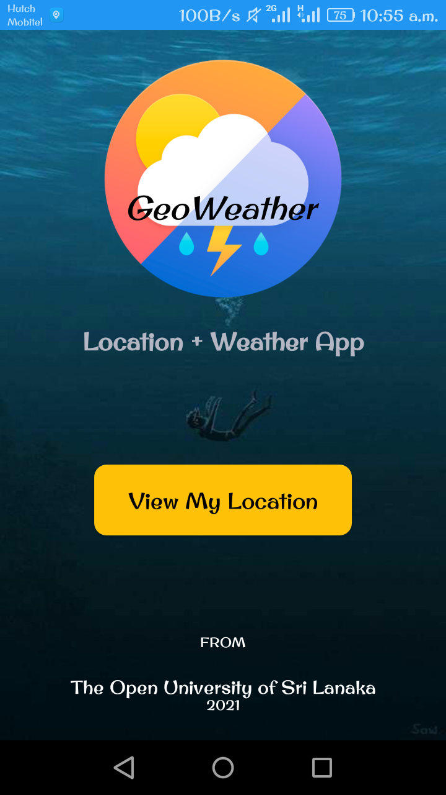
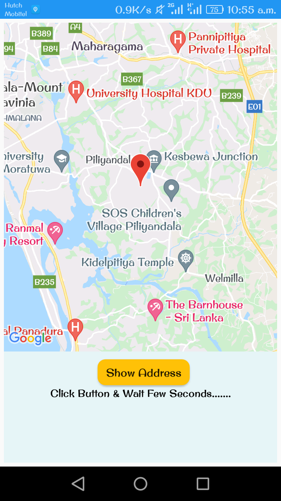
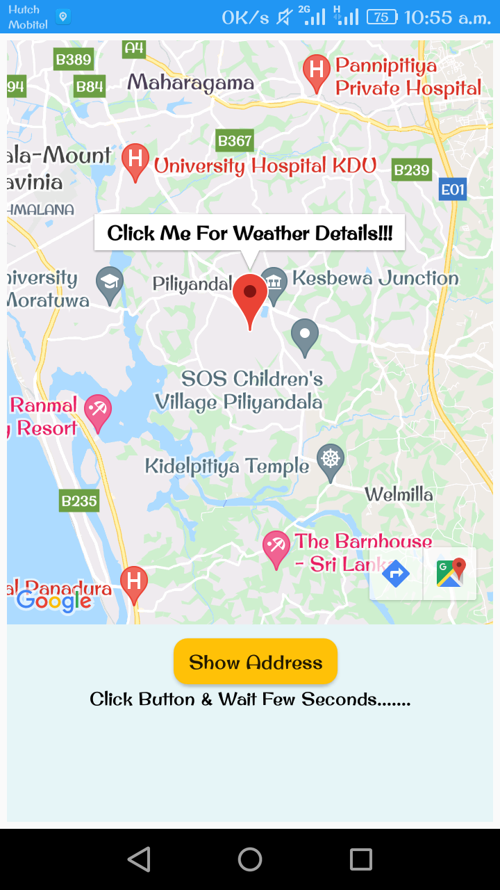
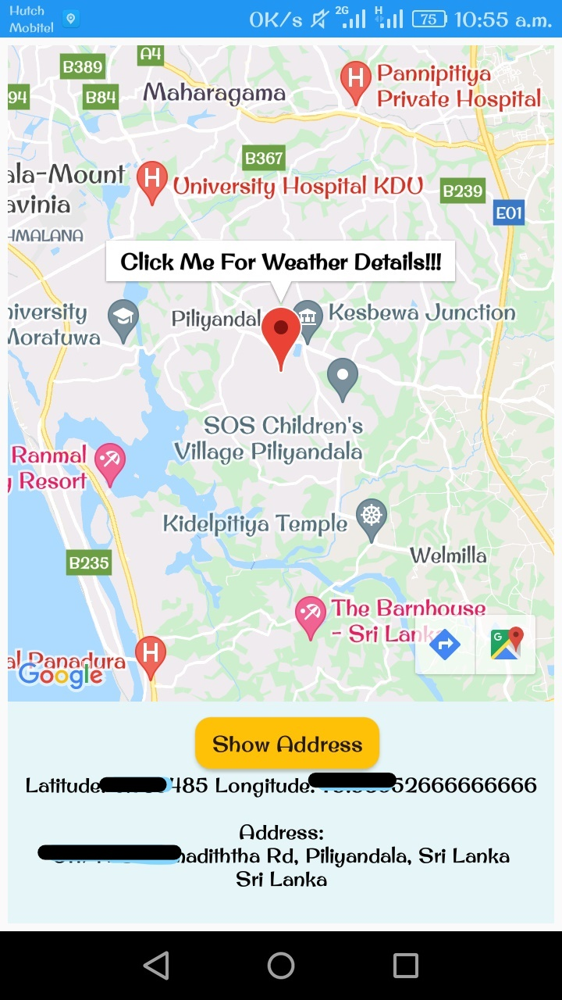
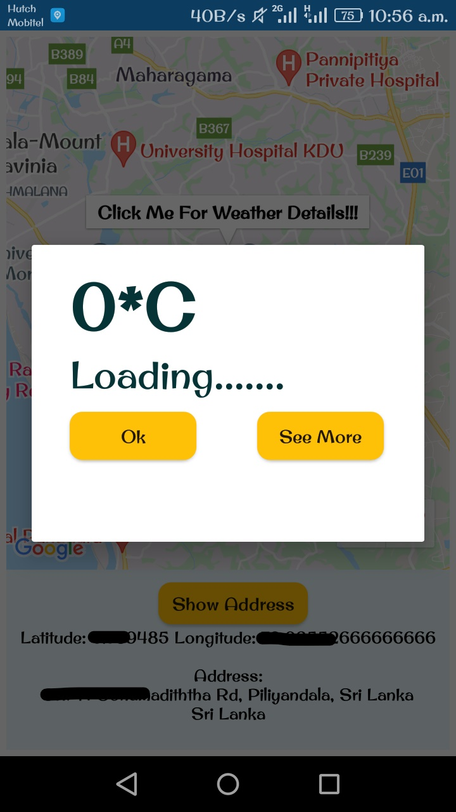
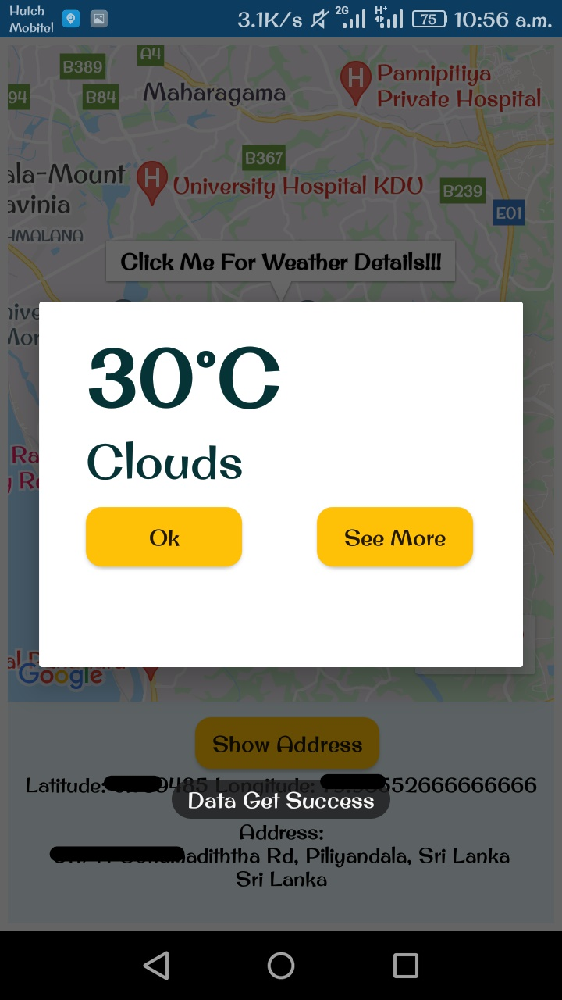
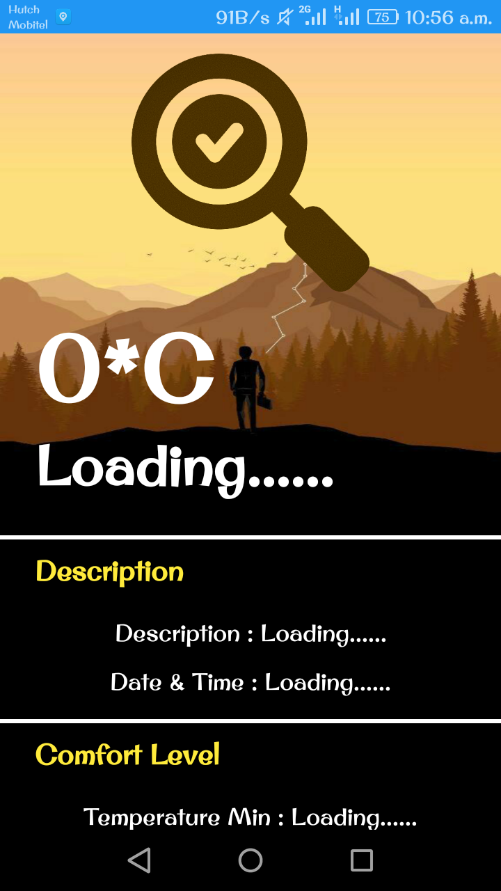
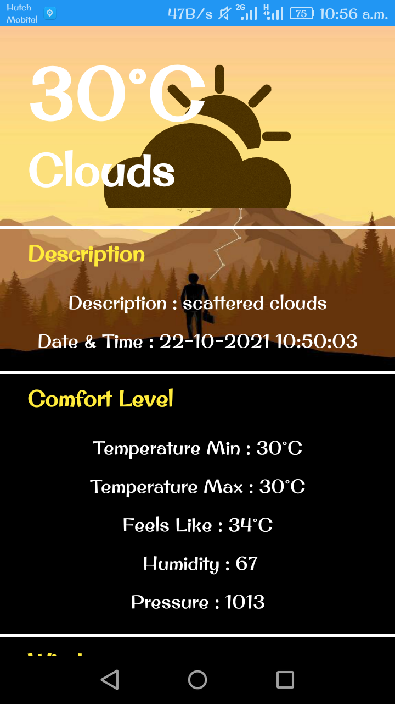
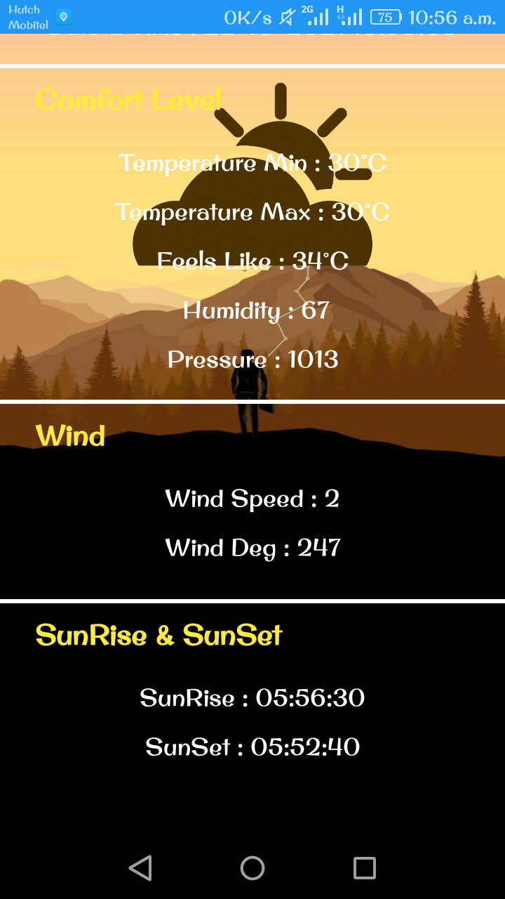

# Find Location with Weather Report on Android - Java

In this project, and I have developed a location finder application with weather report on android. The application is able to display the  user’s  current location on Google map with marker and  track the user’s location, display a compass to determine north, display  the current location  latitude , longitude, display  current location postal address, track current location weather information and  display it on the map and also check the full weather report of the current location. I have used Android Studio software to develop this application.

## Technologies & Tools

Programming Language:
- Java

IDE:
- Android Studio

## Functional Requirements 

- Application should capture the device location and show it on Google map. 
- Should can obtain the address of the location and display it.  
- Whenever the user clicks the current location marker, an information window should pop up and display the current temperature and weather description for the location. 
- When the user clicks the 'show more' button in the information window, another activity should spawn and display a full weather report from the data returned from the API. 

 The application should display a map that is detailed enough to allow the user to find device location. The map is displayed from a Google Map. The required accuracy depends on the purpose of the application, but for most applications the degree of accuracy is sufficient if the application can determine the location accurate enough for the user to be able to know what street or building he is in, this degree of accuracy will be fine.

## Requirements Analysis 

- Programming Language: - Java (JDK 8). 

- Operating System: - The platform used for development of this project was Windows 10 Operating system.

- Android Version: - Minimum requirement for android version of this application is v. 4.4 (Kit Kat). 

-  APIs: - 
     1. Google Maps API.  
     2. Nominatim’s reverse geo coordinates API.
     3. Open weather map's public weather REST API. 

## IMPORTANT !!!

Before run the project you have to some changes to the code.

- Open the 
 
 
## Screenshots

 
 
 
 

 
